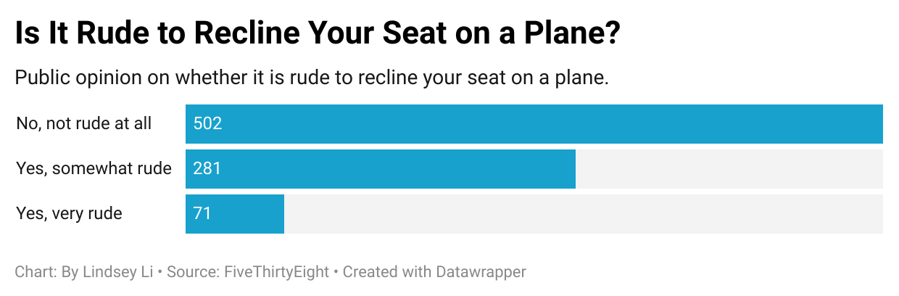

# Data Journalism - Week 4 Homework 
I decided to explore the question  “Is it rude to recline your seat on a plane?” because I was interested in the social etiquette in the confined space of an airplane. I found it interesting that, according to the dataset, a majority of responses revealed that it was not rude at all to recline their seat even thought there is limited personal space on flights. More specifically, my chart reveals that 502 people said it was not rude at all, compared to 281 who said it was somewhat rude, and 71 who believe it as very rude. This suggests that even though reclining is generally not considered rude, a decent number of people still see it as somewhat inconsiderate.

